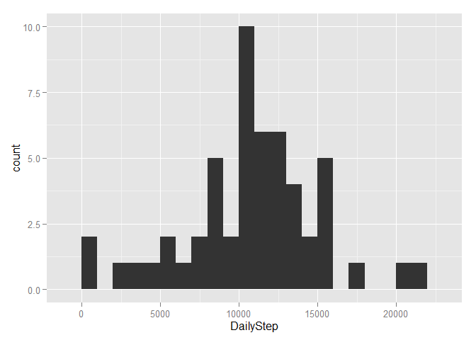
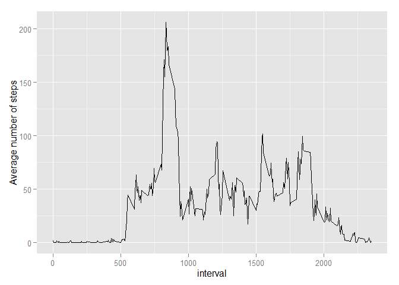
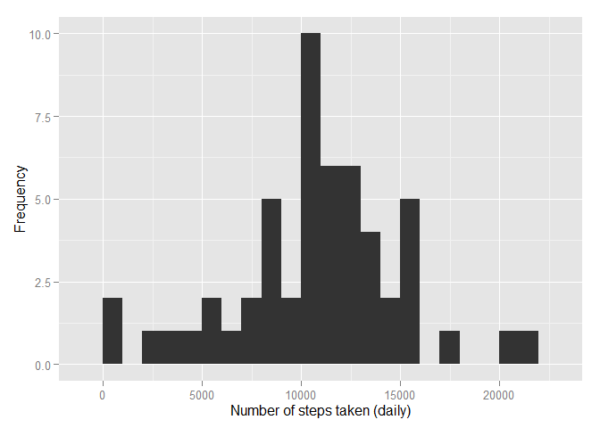
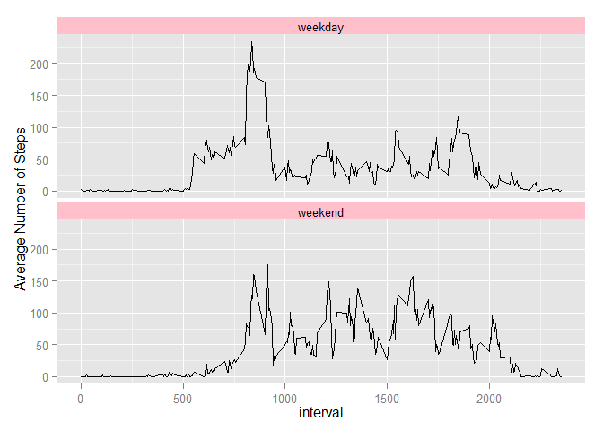

# Reproducible Research: Peer Assessment 1


## Loading and preprocessing the data
#### 1. Load the data

```r
data <- read.csv(unz("activity.zip", "activity.csv"), sep=",",stringsAsFactors=FALSE)
```

#### 2. Transform the data into _data.table_

```r
library(data.table)
dt <- data.table(data);rm(data);gc()
```

```
##        steps       date interval
##     1:    NA 2012-10-01        0
##     2:    NA 2012-10-01        5
##     3:    NA 2012-10-01       10
##     4:    NA 2012-10-01       15
##     5:    NA 2012-10-01       20
##    ---                          
## 17564:    NA 2012-11-30     2335
## 17565:    NA 2012-11-30     2340
## 17566:    NA 2012-11-30     2345
## 17567:    NA 2012-11-30     2350
## 17568:    NA 2012-11-30     2355
```

## The mean total number of steps taken per day.
#### 1. The histogram of the total number of steps taken each day.

```r
library(ggplot2)
dt.DailyStep <- dt[,.(DailyStep=sum(steps)),by=date]
qplot(DailyStep, data=dt.DailyStep, geom="histogram",binwidth=1000)
```

 

#### 2. The mean and median total number of steps taken per day.

```r
dt.DailyStep[,.(Mean=mean(DailyStep,na.rm=T),Median=median(DailyStep,na.rm=T))]
```

```
##        Mean Median
## 1: 10766.19  10765
```

## The average daily activity pattern.
#### 1. Plot of the 5-minute interval and the average number of steps taken, averaged across all days.

```r
dt.DailyActivity <- dt[,.(AverageSteps=mean(steps,na.rm=T)),by=interval]
qplot(x=interval,y=AverageSteps,data=dt.DailyActivity,geom="line") +
  ylab("Average number of steps")
```

 

#### 2. The 5-minute interval, on average across all the days in the dataset, that contains the maximum number of steps:  

```r
dt.DailyActivity[order(AverageSteps,decreasing = T)[1],]
```

```
##    interval AverageSteps
## 1:      835     206.1698
```

## Imputing missing values
#### 1. The total number of missing values in the dataset.

```r
nrow(dt[which(is.na(steps))])
```

```
## [1] 2304
```


#### 2. Fill in all of the missing values in the dataset using the mean for that 5-minute interval and create a new dataset correspondingly.


```r
dt.fill <- dt
dt.fill[which(is.na(steps)),]$steps <- dt.DailyActivity[interval %in% dt[which(is.na(steps)),interval],AverageSteps]
dt.fill
```

```
##        steps       date interval
##     1:     1 2012-10-01        0
##     2:     0 2012-10-01        5
##     3:     0 2012-10-01       10
##     4:     0 2012-10-01       15
##     5:     0 2012-10-01       20
##    ---                          
## 17564:     4 2012-11-30     2335
## 17565:     3 2012-11-30     2340
## 17566:     0 2012-11-30     2345
## 17567:     0 2012-11-30     2350
## 17568:     1 2012-11-30     2355
```
**Comments: Since the variable 'steps' in the raw data set is of type _Integer_, I filled also integers (by taking round of the means).**

#### 3. The histogram of the total number of steps taken each day, the mean and median total number of steps taken per day. 

```r
dt.fill.DailyStep <- dt[,.(DailyStep=sum(steps)),by=date]
qplot(DailyStep, data=dt.fill.DailyStep, geom="histogram",binwidth=1000) +
  xlab("Number of steps taken (daily)") +
  ylab("Frequency")
```

 

```r
dt.fill.DailyStep[,.(Mean=mean(DailyStep,na.rm=T),Median=median(DailyStep,na.rm=T))]
```

```
##        Mean Median
## 1: 10766.19  10765
```
**According to the graph above, we can see that there are no obvious differences by filling the missing values.**

## Activity patterns at weekdays and weekends.
#### 1. Create a new factor variable in the dataset with two levels: 'weekday' and 'weekend' indicating whether a given date is a weekday or weekend day.

```r
dt[,WeekDay:=weekdays(as.Date(dt$date))]
dt[WeekDay=="Sunday" | WeekDay=="Saturday",WD:="weekend"]
dt[!(WeekDay=="Sunday" | WeekDay=="Saturday"),WD:="weekday"]
dt[,WeekDay:=NULL]
```

```
##        steps       date interval      WD
##     1:    NA 2012-10-01        0 weekday
##     2:    NA 2012-10-01        5 weekday
##     3:    NA 2012-10-01       10 weekday
##     4:    NA 2012-10-01       15 weekday
##     5:    NA 2012-10-01       20 weekday
##    ---                                  
## 17564:    NA 2012-11-30     2335 weekday
## 17565:    NA 2012-11-30     2340 weekday
## 17566:    NA 2012-11-30     2345 weekday
## 17567:    NA 2012-11-30     2350 weekday
## 17568:    NA 2012-11-30     2355 weekday
```
#### 2. The panel plot of the 5-minute interval (x-axis) and the average number of steps taken, averaged across all weekday days or weekend days.

```r
dt.DailyActivity.WD <- dt[,.(AverageSteps=mean(steps,na.rm=T),WD=WD),by=.(interval,WD)]
qplot(x=interval,y=AverageSteps,data=dt.DailyActivity.WD,geom="line") +
  facet_wrap(~ WD,nrow=2) +
  ylab("Average Number of Steps") +
  theme(strip.background=element_rect(fill="pink"))
```

 
